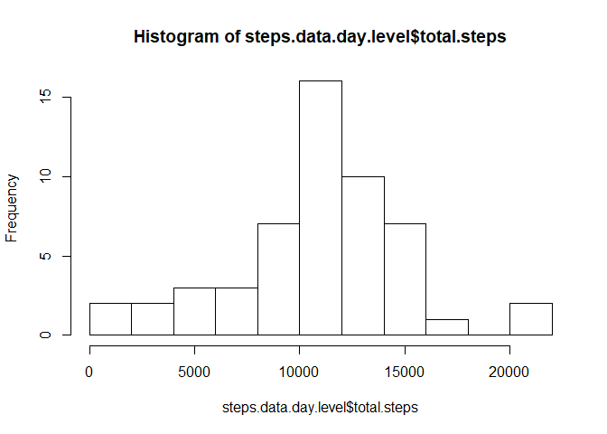
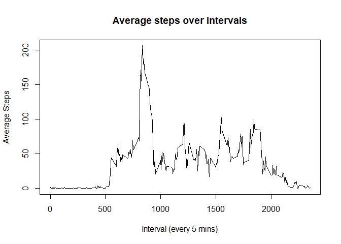
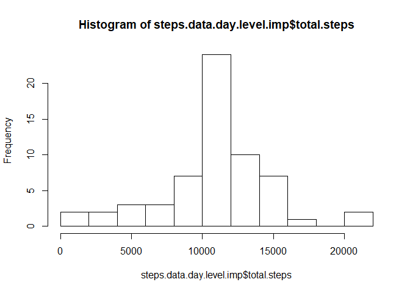
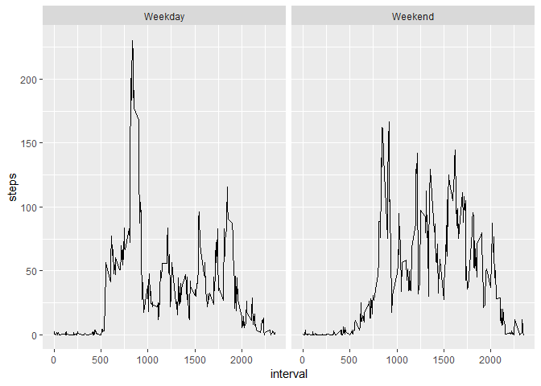

### Loading and preprocessing the data
#### The data is loaded and NULLs are removed


```r
library(dplyr)
library(ggplot2)
setwd("C:/One-Drive/OneDrive - Tredence/MOOCs/01. Data Science Specialization/05. Reproducible Research/01. Week Two PGA/RepData_PeerAssessment1")
steps.data.na = read.table("../activity.csv", sep=",", header = T, stringsAsFactors = F)
steps.data = na.omit(steps.data.na)
```


### What is mean total number of steps taken per day?
#### Histogram of total steps taken each day


```r
steps.data.day.level = steps.data %>% select(date,interval,steps) %>% group_by(date) %>% summarise(total.steps=sum(steps,na.rm = T), avg.steps=mean(steps, na.rm = T))
hist(steps.data.day.level$total.steps, breaks = 8)
```

<!-- -->

#### Mean and Median steps taken per day


```r
day.level.summary = steps.data.day.level %>% summarise(Mean = mean(total.steps, na.rm = T), Median = median(total.steps, na.rm = T))
day.level.summary
```

```
## # A tibble: 1 x 2
##     Mean Median
##    <dbl>  <int>
## 1 10766.  10765
```

### What is the average daily activity pattern?
#### Average steps taken per interval


```r
interval.level.summary = steps.data %>% group_by(interval) %>% summarise(steps = mean(steps, na.rm = T))
plot(interval.level.summary$interval, interval.level.summary$steps, type = 'l',xlab = "Interval (every 5 mins)", ylab = "Average Steps", main = "Average steps over intervals")
```

<!-- -->

#### In the interval in which there is maximum steps

```r
interval.level.summary[which.max(interval.level.summary$steps),]
```

```
## # A tibble: 1 x 2
##   interval steps
##      <int> <dbl>
## 1      835  206.
```

### Imputing missing values
#### Number and Percentage of missing values


```r
paste0("Missing Values: ",sum(is.na(steps.data.na$steps)));paste0("Percent Missing: ",round(mean(is.na(steps.data.na$steps))*100,2),"%")
```

```
## [1] "Missing Values: 2304"
```

```
## [1] "Percent Missing: 13.11%"
```

#### Imputing NULLs with mean steps


```r
data.na = steps.data.na[is.na(steps.data.na$steps),]
data.na = data.na %>% select(date, interval)%>% left_join(interval.level.summary, by = "interval") %>% mutate(steps = round(steps))
steps.data.imp = rbind(steps.data, data.na) %>% select(date, interval, steps) %>% arrange(date, interval)
```

#### Histogram of daily activity after imputing

```r
steps.data.day.level.imp = steps.data.imp %>% select(date,interval,steps) %>% group_by(date) %>% summarise(total.steps=sum(steps,na.rm = T), avg.steps=mean(steps, na.rm = T))
hist(steps.data.day.level.imp$total.steps, breaks = 8)
```

<!-- -->

#### Mean and Median steps taken per day

```r
day.level.summary = steps.data.day.level.imp %>% summarise(Mean = mean(total.steps, na.rm = T), Median = median(total.steps, na.rm = T))
```

### Are there differences in activity patterns between weekdays and weekends?

Yes, there is difference between mean weekday and weekend activity. The person is ~19% more active during the weekends compared to the weekdays.


```r
getDayType = function(x) {
    return(if_else(weekdays(as.Date(x, format = "%Y-%m-%d")) %in% c('Saturday','Sunday'),"Weekend","Weekday"))
}
steps.data.imp = steps.data.imp %>% mutate(weekdayflag = getDayType(date))
interval.level.summary.wd = steps.data.imp %>% group_by(weekdayflag, interval) %>% summarise(steps = mean(steps))
ggplot(interval.level.summary.wd, aes(x = interval, y = steps)) + geom_line() + facet_grid(. ~ weekdayflag)
```

<!-- -->


```r
mean.activity = interval.level.summary.wd %>% group_by(weekdayflag) %>% summarise(mean(steps))
percent.change = round((mean.activity$`mean(steps)`[mean.activity$weekdayflag=='Weekend'] - mean.activity$`mean(steps)`[mean.activity$weekdayflag=='Weekday'])/mean.activity$`mean(steps)`[mean.activity$weekdayflag=='Weekday'],4) * 100
paste0("Percentage change activity in weekend with respective to weekday: ",percent.change, "%")
```

```
## [1] "Percentage change activity in weekend with respective to weekday: 18.97%"
```
